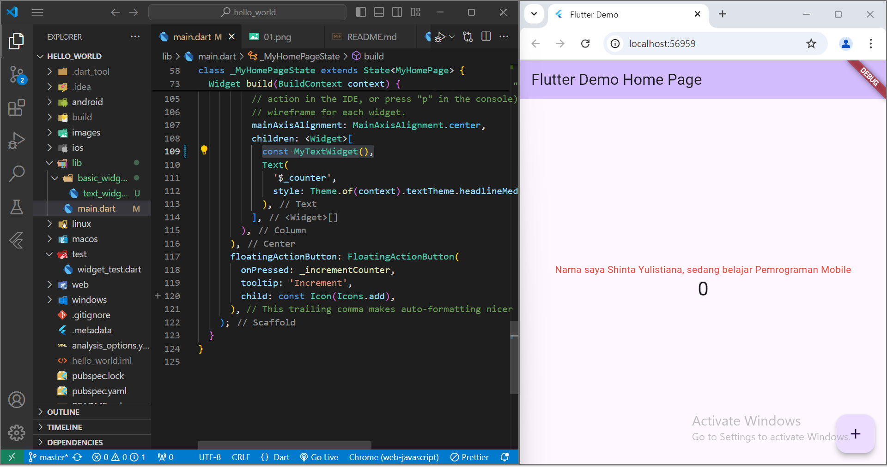
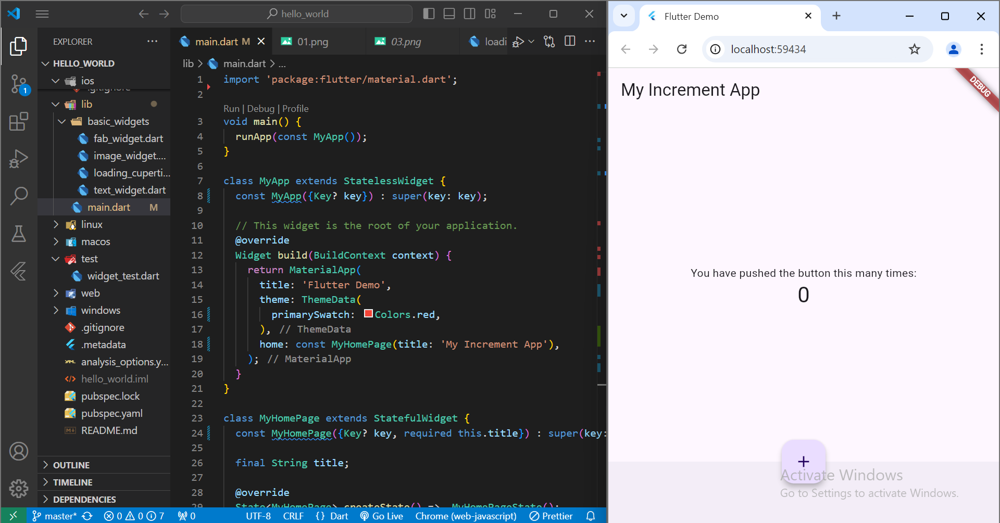
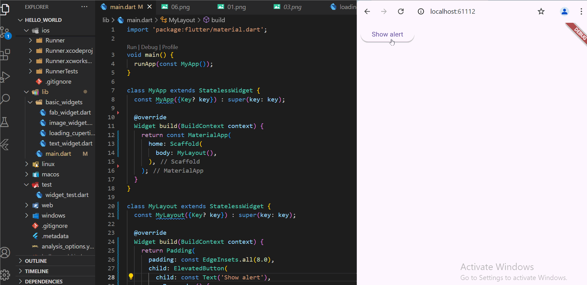

# hello_world

A new Flutter project.

Praktikum 1:

Praktikum 2:
Hasil aplikasi flutter pertama.

Praktikum 3:
Hasil Text Widget.

Hasil Image Widget.

Praktikum 4:
Hasil Cupertino Button dan Loading Bar.

Hasil Floating Action Button (FAB).

Hasil Scaffold Widget.

Hasil Dialog Widget.

Hasil Input dan Selection Widget.

Hasil Date and Time Pickers.

